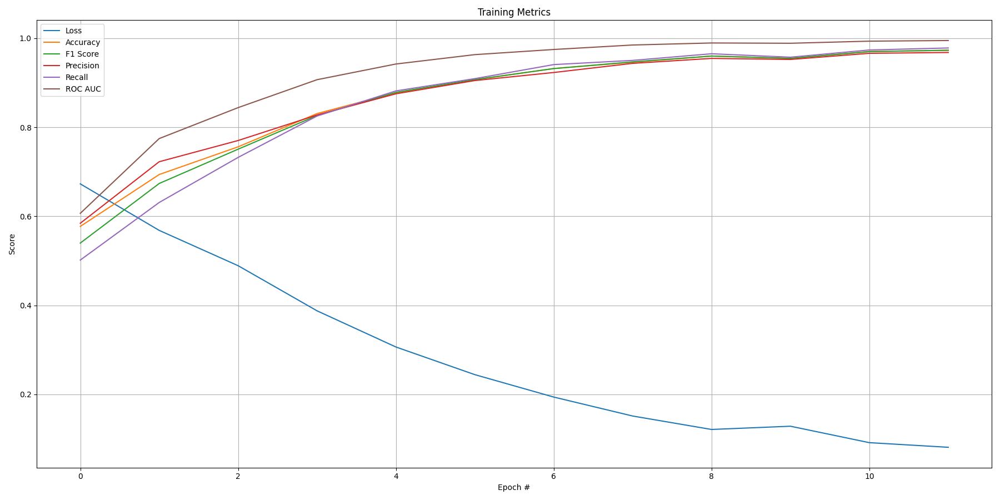

# 9. ISIC 2020 Kaggle Challenge

All filepaths and commands used in this project are relative to the repository's root directory, ```PatternAnalysis-2025/```.

## Algorithm Architecture

A Siamese network is a neural architecture designed to learn a similarity function between pairs of inputs. Instead of directly classifying each image as benign or malignant, it learns a feature embedding space where images of the same class (both benign or both malignant) lie close together, and those of different classes (benign vs malignant) are far apart. This approach is particularly well-suited for medical imaging tasks, such as melanoma detection, where intra-class variability can be high and labeled data may be limited. The Siamese architecture consists of two identical convolutional neural networks (CNNs) sharing weights, each processing one image from a pair. The resulting embeddings are compared through a distance-based function and passed to a classification head that predicts whether the two images belong to the same class.

Each tower of the Siamese network uses a ResNet-34 backbone pretrained on ImageNet to extract high-level features from dermoscopic images. The default fully connected final layer is replaced with a custom fully connected final layer composed of:
- A linear projection layer mapping ResNet’s output to a lower-dimensional embedding space (512 units),
- A batch normalization layer for feature stability,
- A ReLU activation for non-linearity.

The distance between 2 embedding vectors are computed by their absolute distance.

## Dataset

The dataset contains 33,126 dermoscopic training images of unique benign and malignant skin lesions from over 2,000 patients. Each image is associated with one of these individuals using a unique patient identifier. All malignant diagnoses have been confirmed via histopathology, and benign diagnoses have been confirmed using either expert agreement, longitudinal follow-up, or histopathology. A thorough publication describing all features of this dataset is available in the form of a pre-print that has not yet undergone peer review.

The dataset was generated by the International Skin Imaging Collaboration (ISIC) and images are from the following sources: Hospital Clínic de Barcelona, Medical University of Vienna, Memorial Sloan Kettering Cancer Center, Melanoma Institute Australia, University of Queensland, and the University of Athens Medical School.

## Preprocessing & Training 

All images were first standardized to a resolution of 224×224 pixels to ensure compatibility with the ResNet backbone and reduce training time. Images were converted to RGB and normalized using ImageNet statistics, reflecting the pretraining distribution of ResNet. To increase model robustness, on-the-fly augmentations were applied during training, including random horizontal flips and slight rotations of up to 10 degrees. This augmentation strategy introduces variability in the data, helping the model generalize better to unseen skin lesion images.

A Siamese network requires input as pairs of images along with a label indicating whether the pair belongs to the same class (benign or malignant). Training pairs were generated dynamically from the dataset metadata where positive pairs were composed of two distinct images from the same class, while negative pairs combined one image from each class. Each epoch generated approximately 15,000 random pairs totaling 30,000 images, maintaining a roughly balanced distribution of positive and negative examples. This approach ensures the model learns to map images to a meaningful embedding space where intra-class distances are small and inter-class distances are large.

## Validation & Inference

To evaluate generalisation performance during training, a ratio of 85:15 of the dataset was used (85% for training, 15% for validating). The validation dataset was constructed from the same pair-generation process as the training data, but with distinct random sampling. Importantly, no images were shared between training and validation splits, preventing data leakage. Validation pairs were fed in batches of 32 without shuffling to allow consistent performance measurement at the end of each epoch.

For inference, single images were used rather than pairs, reflecting real-world deployment where the model is tasked to classify an unseen lesion. Images were preprocessed identically to the training data but without random augmentations to ensure deterministic embeddings. For classification, embeddings of test images can be compared to reference embeddings from the training set using the trained Siamese classifier. This setup enables a robust evaluation of the model’s ability to distinguish between benign and malignant lesions based solely on learned similarity in the embedding space.

## Visualisation & Results

Training Results (values are placeholders, not indicative)

- Loss: 0.35
- Accuracy: 0.81
- F1 Score: 0.85
- Precision: 0.84
- Recall: 0.85



- Test Accuracy: 0.78

## Dependencies

All required dependencies are listed in ```requirements.txt```, generated using ```pip freeze```. To install dependencies listed in ```requirements.txt```, run the command below,

```pip install -r ./recognition/s4696725_siamese/requirements.txt```.